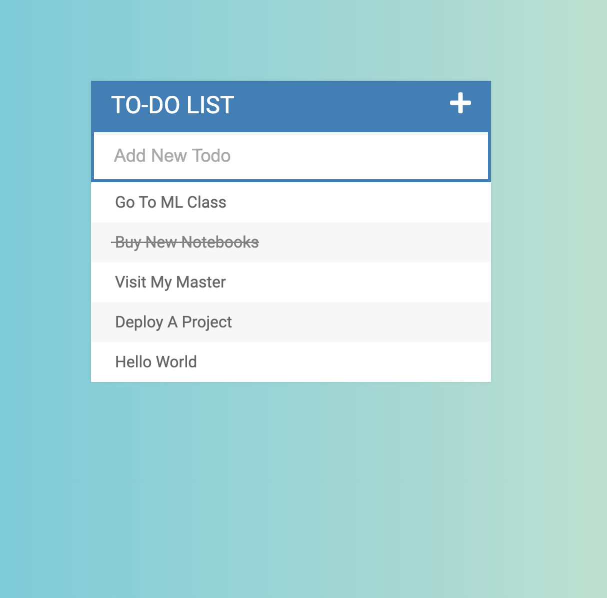

# ➕ Todo_List
Simple HTML/CSS/JS Todo List.

## 🤔 How to use this project

To get started just open index.html file

## 💁 What You're Getting
```bash
├── index.html
├── assets - This has the css/js files
├──── Css/style.css         # Styles for todo list
├──── JS/todos.js           # Js logic for the list
├──── JS/lib/jquery...      # Jquery library added
```

## 📸 Screenshot from the Todo List

